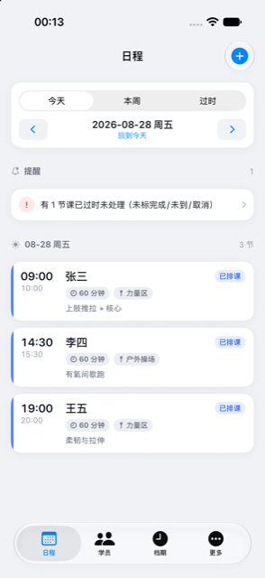
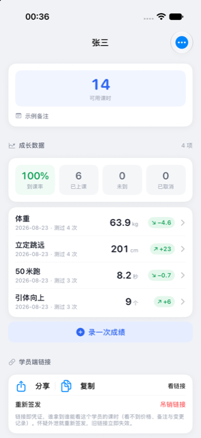
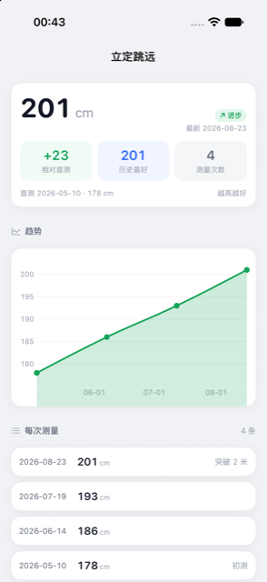
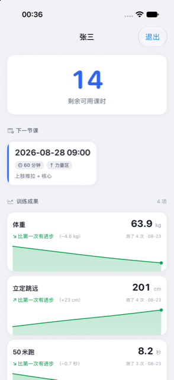
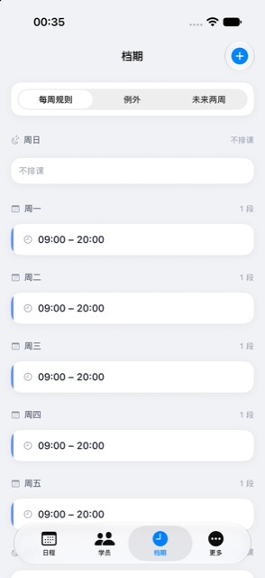
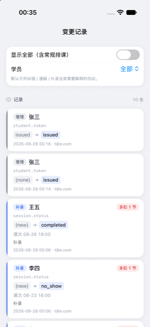

<p align="center"></p>

# 上门体育 · fitcoach-ios

**教练手机上排课扣课时，学员随时看还剩几节。**

    

给一位真实教练做的生产系统手机端，与网页端、小程序端共用同一后端、同一份数据。上线前 38 项契约断言对着临时后端真打真测——还因此发现过「端口被占时打到另一台服务器上全绿」这种比红更危险的绿。

<table><tr>
<td align="center" width="25%"><br><sub>日程：过时未处理的课会被点名（示例数据）</sub></td>
<td align="center" width="25%"><br><sub>学员页：课时余额、到课率、体测成长（示例数据）</sub></td>
<td align="center" width="25%"><br><sub>体测趋势：50 米跑变快=数值变小，也算进步</sub></td>
<td align="center" width="25%"><br><sub>学员端：只读，剩几节课、下一节课、体测进步一屏看全（示例数据）</sub></td>
</tr></table>

<details><summary>更多截图</summary><table><tr>
<td align="center" width="25%"><br><sub>档期：每周规则 + 例外 + 未来两周，排课冲突由后端硬拒</sub></td>
<td align="center" width="25%"><br><sub>变更记录：纠错/通融/补录这类需要解释的改动，每一笔都留痕（示例数据）</sub></td>
</tr></table></details>

## 它做什么

| 功能 | 说明 |
|---|---|
| **教练单手排课、扣课时** | 日程页直接排课、标完成、标缺席；过时未处理的课会被点名。所有业务判据（余额、状态机、冲突）都在后端一份，客户端零本地判断——两边各留一份判据迟早说不同的话。 |
| **学员端只读，一个链接就能看** | 学员拿到的是只读视图：还剩几节、下一节课什么时候、体测进步了多少。停用学员会同时吊销他的链接。 |
| **每一笔变更都有解释** | 纠错、通融、补录——需要解释的改动默认全部留痕，多扣一节这样的敏感操作单独标红。做生产系统给真实客户用，对账能力就是信任的来源。 |

## 怎么拿到

TestFlight 内测中；产品落地页 fit.tianli.cyou 公开可看。

后端 `fit.tianli.cyou`（注册即得自己的账本），与网页端、小程序端同一份数据。clone 下来能跑，登录后是你自己的数据。

## 构建

```bash
brew install xcodegen
xcodegen generate
xcodebuild -scheme FitCoach -destination 'generic/platform=iOS Simulator' build
```

- 仓里的 `*.sh` 是作者本机舰队脚本的 shim（三平台构建 / 真机装机 / TestFlight），依赖 `~/Dev` 下的总部工具，不在本仓；没有那套工具时它们会明确退出。
- `Shared/PlatformCompat.swift` 是总部共享文件的逐字节副本（iOS-only SwiftUI 修饰符在 macOS 侧的同名 no-op），别在这里改它。

开发细节（回归、验证通道、约束）见 [DEVELOPING.md](DEVELOPING.md)。

## 相关

- 产品页：<https://apps.tianli.cyou/p/fitcoach-ios.html>
- 舰队总览（10 个 app 怎么来的）：<https://apps.tianli.cyou/ios.html>
- 教程：[从零到 TestFlight：一个人做 iPhone app 的完整路径](https://blog-ai.tianli.cyou/nine-ios-apps-in-two-weeks)

## License

MIT © 2026 曾田力 (Tianli Zeng)
