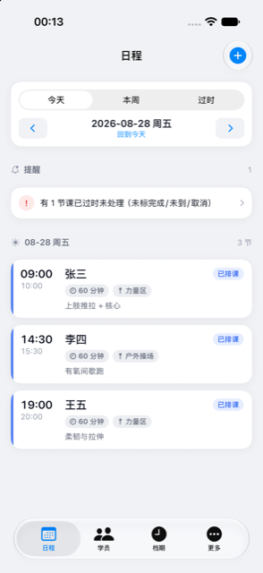
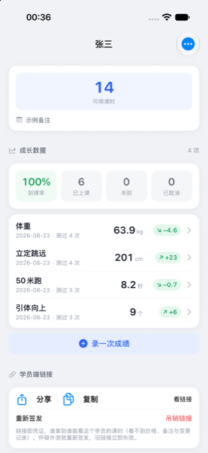
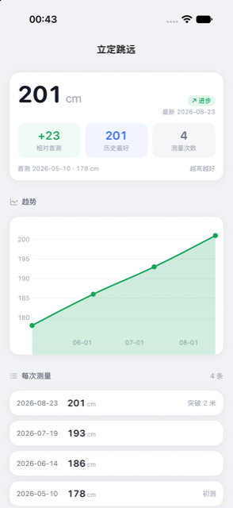
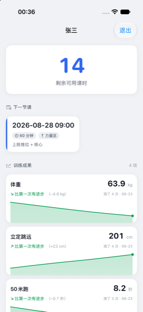
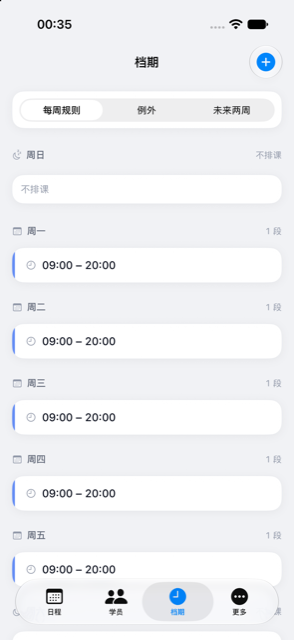
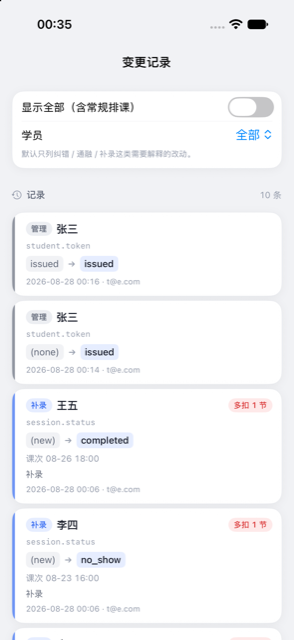

**中文** | [English](README_EN.md)

<p align="center"></p>

# 上门体育 · fitcoach-ios

**教练手机上排课扣课时，学员随时看还剩几节。**

    

给一位真实教练做的生产系统手机端，与网页端、小程序端共用同一后端、同一份数据。上线前契约断言（现为 57 项）对着临时后端真打真测——还因此发现过「端口被占时打到另一台服务器上全绿」这种比红更危险的绿。

<table><tr>
<td align="center" width="25%"><br><sub>日程：过时未处理的课会被点名（示例数据）</sub></td>
<td align="center" width="25%"><br><sub>学员页：课时余额、到课率、体测成长（示例数据）</sub></td>
<td align="center" width="25%"><br><sub>体测趋势：50 米跑变快=数值变小，也算进步</sub></td>
<td align="center" width="25%"><br><sub>学员端：只读，剩几节课、下一节课、体测进步一屏看全（示例数据）</sub></td>
</tr></table>

<details><summary>更多截图</summary><table><tr>
<td align="center" width="25%"><br><sub>档期：每周规则 + 例外 + 未来两周，排课冲突由后端硬拒</sub></td>
<td align="center" width="25%"><br><sub>变更记录：纠错/通融/补录这类需要解释的改动，每一笔都留痕（示例数据）</sub></td>
</tr></table></details>

## 它做什么

| 功能 | 说明 |
|---|---|
| **教练单手排课、扣课时** | 日程页直接排课、标完成、标缺席；过时未处理的课会被点名。所有业务判据（余额、状态机、冲突）都在后端一份，客户端零本地判断——两边各留一份判据迟早说不同的话。 |
| **学员端只读，一个链接就能看** | 学员拿到的是只读视图：还剩几节、下一节课什么时候、体测进步了多少。停用学员会同时吊销他的链接。 |
| **每一笔变更都有解释** | 纠错、通融、补录——需要解释的改动默认全部留痕，多扣一节这样的敏感操作单独标红。做生产系统给真实客户用，对账能力就是信任的来源。 |

## 怎么拿到

iOS 版正在准备 App Store 发布，暂未开放公开下载；源码与产品介绍可公开查看。

后端 `fit.tianli.cyou`（注册即得自己的账本），与网页端、小程序端同一份数据。clone 下来能跑，登录后是你自己的数据。

## 构建

```bash
brew install xcodegen
xcodegen generate
xcodebuild -scheme FitCoach -destination 'generic/platform=iOS Simulator' build
```

- 仓里的 `*.sh` 是作者本机舰队脚本的 shim（三平台构建 / 真机装机 / TestFlight），依赖 `~/Dev` 下的总部工具，不在本仓；没有那套工具时它们会明确退出。
- `Shared/PlatformCompat.swift` 是总部共享文件的逐字节副本（iOS-only SwiftUI 修饰符在 macOS 侧的同名 no-op），别在这里改它。

开发细节（回归、验证通道、约束）见 [DEVELOPING.md](DEVELOPING.md)。

## 命令行（给智能体用）

App 给人用，`fitcoach` 命令行给智能体用。它把 App 自己的 `Sources/Models.swift`、`TimeKit.swift`、`API.swift`、`QuickSetup.swift` 与 `cli/*.swift` 编成一个 macOS 命令行，打同一套 `/coach/api/*`：读到、改到的就是 App、网页、小程序里的同一份数据，业务判据仍只在后端。

放在哪：Mac 版 App 构建时把它编进包里，`上门体育.app/Contents/Resources/bin/fitcoach`（`project.yml` 的 `FitCoachCLI` 目标，只对 macOS 生效，iOS 包不带）。装好 Mac 版后用 `bash cli/build.sh --link-app` 把 `~/.local/bin/fitcoach` 链进包里；没装 Mac 版时用仓库入口。

```bash
bash cli/build.sh --link-app # 已装 Mac 版：~/.local/bin/fitcoach → 包内 Contents/Resources/bin/fitcoach
bash cli/build.sh --link     # 没装 Mac 版：编到 build/cli/fitcoach，并把 ~/.local/bin/fitcoach 链到仓库入口 cli/fitcoach
printf '%s\n' "$PASSWORD" | fitcoach login --email coach@example.com --password-stdin
fitcoach status --json                                   # 登录态、账号、服务端今天/现在
fitcoach schedule --range week --json                    # 日程与预警条
fitcoach sessions options --student 3 --json             # 排课前先拿 package_id / location_id
fitcoach sessions add --package 5 --start '2026-10-08 10:00' --minutes 60 --location 1 --json
fitcoach sessions status 42 --to completed --json        # 扣课时
fitcoach students link 3 --reveal | fitcoach student-view --token-stdin --json   # 核对学员实际看到的内容
```

| App 里能看、能做的 | 命令 |
|---|---|
| 登录态、登录账号 | `status` · `login` · `logout` · `register` · `password` |
| 日程：今天 / 本周 / 过时，预警条 | `schedule [--range today\|week\|overdue] [--date D]` |
| 学员：列表、详情、链接状态 | `students list` · `students show ID` · `students link ID [--reveal]` |
| 学员：新建、编辑、启停，签发 / 换发 / 吊销链接 | `students add` · `students update ID` · `students issue-link ID [--replace]` · `students revoke-link ID --reason R` |
| 排课选项、排课、补录、改课、改状态（扣课时） | `sessions options` · `sessions add` · `sessions edit ID` · `sessions status ID --to S` · `sessions show ID`（含这一节的变更记录） |
| 课包：新建、编辑、作废 / 撤销作废 | `packages add` · `packages edit ID` · `packages void ID --yes`（先用 `--dry-run` 看会取消几节）· `packages void ID --undo` |
| 地点、档期规则与例外 | `locations list\|add\|update` · `availability show\|add-rule\|rm-rule\|add-exception\|rm-exception` |
| 体测项目、成长数据、测量 | `metrics list\|add\|update\|seed` · `growth STUDENT_ID [--metric ID]` · `measurements add` · `measurements rm ID --yes`（`--dry-run` 只读出那一条） |
| 变更记录 | `audit [--all] [--student ID]` |
| 学员端只读视图 | `student-view --token-stdin` |
| 快速开始（与 App 同一份编排） | `setup [--location 名称] [--days weekdays\|daily\|weekend]` |
| 注销账号（整租户真删） | `account delete --confirm delete-account`（先用 `--dry-run` 核对目标） |

- 每个命令都有 `--help`；`--json` 输出 `{"ok": true, …}`，读命令原样带出后端字段（小数按最短写法输出，与后端原文一致，如 `12.3`）；失败输出 `{"ok": false, "code": …, "error": …}`。
- 退出码：0 成功 · 1 网络、服务端 5xx（`server_error`，可稍后重试）或响应解析 · 2 用法 · 3 未登录或学员链接失效 · 4 后端拒绝（400 硬拒，`--force` 也不放行）· 5 需要 `--force`（409 软警告）或 `--yes` / `--confirm` 确认 · 6 登录失败或过频（401 / 429）· 7 要读的记录不存在。
- 7 只用于读取、先读后改的 `update` / `edit` 和 `--dry-run`；直接写入（`sessions status`、`packages void`、`measurements rm`、`availability rm-rule` 等）对不存在或别的教练的 id，后端返回 400「…不存在」，退出码是 4。
- 删数据要显式确认，与 App 的确认框对应：`measurements rm` 与 `packages void`（会连带取消包内已排的课）不带 `--yes` 退出 5；`account delete` 要字面量 `--confirm delete-account`。三者都有只读的 `--dry-run`。
- `setup` 与 App「快速开始」同一份编排，只补空白、不改不删：已有规则全是所选日子上的 09:00–18:00（包括上次中途失败留下的）时只补还缺的那几天；有别的时段、所选以外的星期或任何例外，档期一项不动。
- 编辑命令先读现值再整条提交：后端更新端点缺字段会清空地点、到期日、单价，或把学员 / 地点 / 项目静默停用。
- 密码与学员口令只从 stdin 或终端不回显输入读，不进命令行参数；学员链接默认只报 `has_link`，加 `--reveal` 才输出。
- 凭证存本机 `~/Library/Application Support/FitCoach/cli/credentials.json`（目录 0700、文件 0600，按服务器分条，`FITCOACH_CLI_HOME` 可改），不读写 App 的登录。后端会话是 30 天无状态签名，`logout` 只能删本机这份。
- 服务器默认 `https://fit.tianli.cyou`，用 `--base URL` 或 `FITCOACH_BASE` 改。
- 只在 App 里：趋势图、分享面板与复制链接、下拉刷新、日期 / 时间选择器、改服务器地址、截图直达参数。
- 测试：`bash ref/run` 在契约对账后接着跑 `cli/test.sh`（隔离本地后端、临时凭证目录，覆盖上面每条命令的成功与失败路径）；`FITCOACH_TEST_CLI=<包内 fitcoach> bash cli/test.sh` 对 Mac 包里那份跑同一套。
- 资源（2026-09-30，Mac16,12 / macOS 27.2）：`--help` 约 11 ms、峰值内存约 2 MB；本机后端读一次约 40–75 ms、约 4 MB；二进制约 1.2 MB（包内通用二进制约 1.4 MB）；不常驻。明细见 `perf/lightweight.json` 的 `cli`。

## 相关

- 产品页：<https://apps.tianli.cyou/p/fitcoach-ios.html>
- 舰队总览（10 个 app 怎么来的）：<https://apps.tianli.cyou/ios.html>
- 教程：[从零到 TestFlight：一个人做 iPhone app 的完整路径](https://blog-ai.tianli.cyou/nine-ios-apps-in-two-weeks)

## License

MIT © 2026 曾田力 (Tianli Zeng)

<!-- lightweight:start -->
## 资源占用

安装包为 App Store 数据；内存、CPU 与启动时间为 iOS 模拟器实测，不是真机数值。

| 安装包 | 空闲内存 | 空闲 CPU | 模拟器冷启动到首屏就绪 |
|---|---|---|---|
| **3.0 MB**（装好后 4.1 MB） | **27.3 MB** | **0%** | **1.5 s** |

体积按具体发行构建回读；真机尚未测量，内存、CPU 与启动时间先用 iOS 模拟器实测并标明环境。

<sub>v1.0 (5) · iPhone 17（iPhone18,3）；体积为 Apple 设备切片记录，运行性能尚未真机实测 · App Store；体积不含用户数据与后续缓存；手机实际安装版本尚未核验 · 2026-09-26。体积来自 Apple App Store Connect 对应构建的设备切片记录。内存、CPU 与启动时间是 iPhone 17 Pro / iOS 27.0 Simulator / Mac16,12 / Apple M4 / macOS 27.2 上本地源码 Release 构建 v1.0 (1) 的实测（2026-09-27），只统计 App 进程，不等于真机数值；真机测量尚未完成。内存口径为 phys_footprint；CPU 为 60 秒采样窗内 CPU 时间 ÷ 墙钟；大小按十进制 MB。原始数据见 [perf/lightweight.json](perf/lightweight.json)。</sub>
<!-- lightweight:end -->
